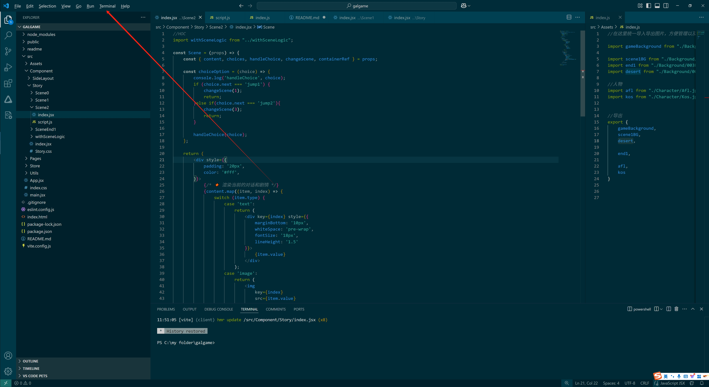
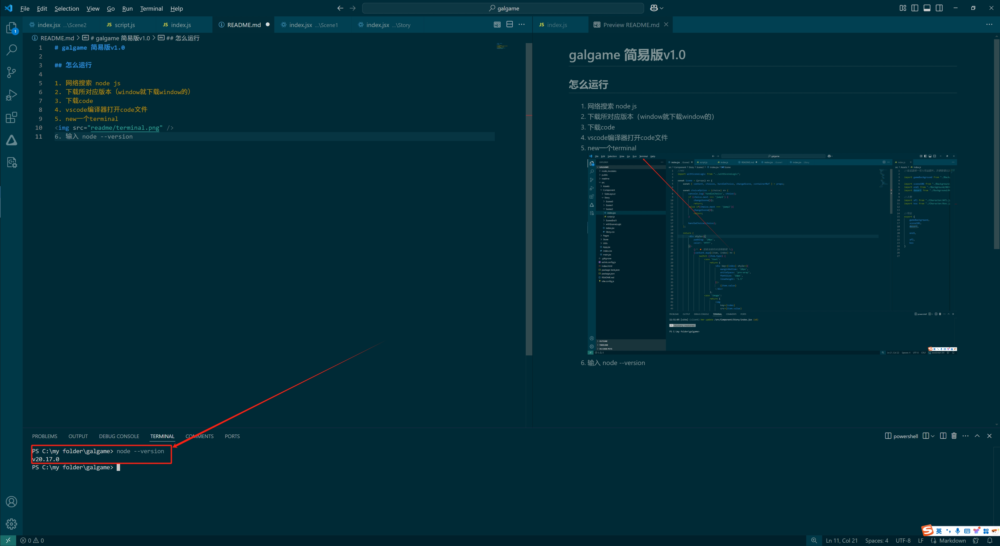

# galgame 简易版v1.0

## 运行锦囊

1. 网络搜索 node js
2. 下载所对应版本（window就下载window的）
3. 下载code
4. vscode编译器打开code文件
5. new一个terminal



6. terinal输入
```
node --version
```
检查是否下载成功，如果安装了node js但是没有显示，重启一下vscode就好了



7. terinal输入
```
npm -i
```
这个指令是安装指令，将所需要的library加载好

8. termianl 输入
```
npm run dev
```
这将会启动网页，你可以在网页端输入`http://localhost:5173/` 找到网页